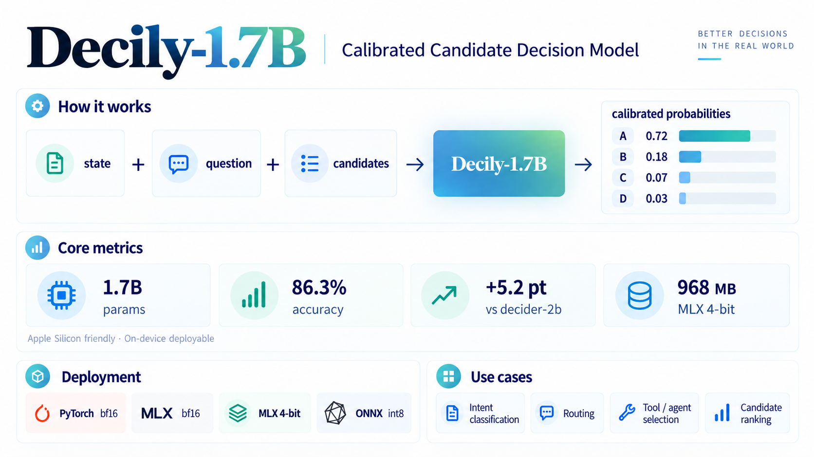

# Decily — calibrated candidate-scorer decision model

**Decily** scores a runtime-provided set of candidates against a `state` and a
`question`, and returns a **calibrated probability distribution** over those
candidates. It does not generate text. Decily is built for decisions where you
want a probability you can threshold, not a sentence you have to parse.



```python
Decily.decide(
    state="Our app crashes on startup after the latest update.",
    question="What is the customer's intent?",
    options=["technical", "billing", "shipping", "returns"],
)  # -> {"technical": 0.9999, "billing": 0.0001, "returns": 0.0, "shipping": 0.0}
# measured with the released weights (bf16, T=0.45)
```

## Model family

This card covers all four released artifacts; they are the same model in
different containers.

| Variant | Format | Size | Target |
|---|---|---|---|
| **[Decily-1.7B](https://huggingface.co/alexzhang0118/Decily-1.7B)** | PyTorch bf16 safetensors + `config.json` | ~3.4 GB | server / GPU |
| **[Decily-MLX](https://huggingface.co/alexzhang0118/Decily-MLX)** | MLX bf16 safetensors | ~3.4 GB | Apple Silicon |
| **[Decily-MLX-4bit](https://huggingface.co/alexzhang0118/Decily-MLX-4bit)** | MLX 4-bit (group-64 affine) | 968 MB | on-device / low memory |
| **[Decily-ONNX-int8](https://huggingface.co/alexzhang0118/Decily-ONNX-int8)** | ONNX int8 (single file) | 1.66 GB | CPU / Windows / edge |

## Model details

- **Model type:** cross-encoder candidate scorer. The backbone encodes
  `state + question + candidate` jointly; an attention-pooling layer over all
  tokens feeds a LayerNorm/GELU MLP that outputs one logit per candidate.
  Probabilities come from the softmax over the candidates you pass in.
- **Backbone:** `Qwen/Qwen3-1.7B-Base` (1.72B parameters, Apache-2.0), with an
  attention-pooling scoring head (`decision_head` recorded in `config.json`;
  pool/head weights live in the checkpoint).
- **Input limits (training configuration):** `state` ≤256 tokens, `question`
  ≤96 tokens, each candidate ≤64 tokens, 2–16 candidates per call. Longer
  inputs are truncated — for long documents, chunk the state and score chunks
  separately (the cross-encoder logits are candidate-set independent, so
  chunked shortlisting then re-ranking is lossless; see the repository's
  two-stage inference utility).
- **Precision:** bf16 (PyTorch/MLX), 4-bit affine group-64 (on-device),
  int8 (ONNX).
- **Temperature:** raw logits are over-confident out of distribution. Fitted
  temperatures observed: ≈1.1 (in-domain), ≈0.45 on unseen label sets, ≈1.35 on
  the zero-shot fair suite. Always report/calibrate the temperature for your
  data (see Evaluation).

## Training summary

Full, reproducible recipe: [TRAINING.md](https://github.com/arczhi/decily/blob/main/TRAINING.md)
in the training repository [arczhi/decily](https://github.com/arczhi/decily)
(design rationale in `DESIGN.md`, all experiments and ablations in
`TRAIN-REPORT.md`).

| Stage | What | Notes |
|---|---|---|
| Teacher | 45-task Qwen3.5-2B decision model (LoRA, frozen backbone) | reference labeler |
| SFT | Qwen3-1.7B LoRA on 24 task families (hard labels) | 3000 steps ≈1 h |
| RLCD members | v1 / v2 LoRA + one full-FT member | belief calibration, abstention |
| Distillation | 4-model probability-space ensemble → **single full-FT student** | KD T=2, α=0.5, +15% belief rows |
| v5 (this model) | full fine-tune, 3000 steps, effective batch 16, lr 1e-5, 8-bit AdamW | ≈1.5 h on one RTX 5090 32 GB |

Key recipe properties:

- **Route B (explicit candidate scorer)** beats the LM-head-letter-logits route
  (Route A) by **+10.6 pt** held-out accuracy in a controlled same-backbone test.
- **Ensemble distillation:** the 4-model ensemble reaches NLL 1.455; the
  distilled single model reaches **1.451** at 1× inference cost.
- **Consumer hardware:** the whole pipeline trains on a single RTX 5090 32 GB
  in well under a day.

## Evaluation

Protocol: accuracy / NLL / ECE after **temperature fitting** (raw T=1 numbers
are over-confident). "In-task" = the 24 trained task families; "held-out" =
unseen label sets; "fair suite" = 8 tasks unseen by both this model and the
external baseline.

| Evaluation | Decily (24 tasks) | decider-2b (95 tasks) |
|---|---|---|
| In-task, 24 task families (shared training tasks) | **0.863 / 0.390 / 0.034** | 0.811 / 0.453 / 0.032 |
| Fair suite, zero-shot (8 tasks × 300) | 0.654 / 0.86 / 0.092 | **0.700 / 0.71 / 0.047** |
| Held-out label sets (60/77-class intents, 1200) | 0.581 / 1.451 / 0.068 | — (scores include tasks it was trained on) |

Selective prediction (unseen label sets): taking only the most-confident **5%**
of predictions gives **93.3%** accuracy (an SFT baseline with the same protocol
gives 79%); abstention thresholds can be calibrated to a target error rate
(empirically 4.7% achieved at a 5% target).

Honest reading of the numbers:

- Decily leads the larger, 95-task decider-2b by **+5.2 pt** on tasks both were
  trained on, at 1.7B vs 2B parameters and ~1/4 of the task coverage.
- On tasks **neither** model has seen, decider-2b leads by 4.6 pt; the gap is
  concentrated in knowledge-heavy tasks (sciq / pubmedqa / quality).
- The zero-shot gap is an **efficiency** result, not a ceiling: with this
  recipe, task coverage — not parameter count — is the documented main lever.
  Scaling the 24-task mixture toward 60–95 tasks with the same pipeline is
  expected to close and exceed the baseline (see `TRAINING.md`).

## Uses

**Direct use**

- Classification / ranking / selection when the label set is known at runtime
  and may change per call (intents, topics, sentiment, NLI-style relations,
  multiple-choice answers, routing, moderation labels, tool selection).
- Calibration-sensitive automation: threshold the probability, auto-handle the
  confident head and escalate the rest to a human or a larger model.
- On-device / private inference: 968 MB 4-bit build, no GPU required.
- Synthetic decision data generation and reward/verifier scoring for LLM
  pipelines (it returns probabilities, not text).

**Out of scope**

- Text generation, chat, summarization.
- Open-ended label spaces (the candidate set must be provided at call time).
- High-stakes decisions without a calibrated threshold and human review.
- Very long inputs beyond the 256-token state window without chunking.

## Quick start

Apple Silicon (MLX) — the standalone reference implementation ships with the
training repository (`mlx/decision_mlx.py`, pure `mlx.core`, no torch):

```bash
python mlx/decision_mlx.py --model-dir <Decily-MLX dir> \
  --state "The invoice was paid twice..." \
  --question "What is the customer's intent?" \
  --options "billing,technical,shipping,returns" \
  --temperature 0.45
```

4-bit on-device: load the quantized tower with `mlx_lm.load` and apply the
attention-pooling head from `decision_head.safetensors` (both files are in the
repository; `config.json` records the head spec).

PyTorch: load `model.safetensors` + `config.json` with the training repository's
model class; the checkpoint keeps backbone and head under their training key
names (`model.*`, `pool.*`, `head.*`).

## Limitations

- **Task coverage:** trained on 24 task families; zero-shot behavior on unseen
  domains trails a 95-task baseline (see Evaluation). Validate on your domain
  before trusting the probabilities.
- **Calibration drift:** the model needs temperature scaling; the fitted value
  depends on the data distribution (≈0.45–1.35 in our measurements).
- **Input truncation:** `state` is truncated at 256 tokens; long documents must
  be chunked (importance within a chunk, then combine).
- **Language:** training data is predominantly English (some multilingual
  intent data); other languages are untested.
- **No safety layer:** outputs are probabilities over the candidates you
  provide; the model does not refuse or filter inputs. Do not expose it as an
  autonomous decision-maker in safety-critical settings.
- **Inherited biases:** as a fine-tune of Qwen3-1.7B-Base on public datasets,
  it can reproduce biases present in those datasets (toxicity, sentiment and
  bias-classification tasks were part of the mixture, which reduces but does
  not eliminate this).

## Environmental impact

Training used a single RTX 5090 32 GB: teacher ≈4 h, SFT ≈1 h, members ≈1 h,
distillation ≈1.5 h (plus data conversion). Total well under 10 GPU-hours; no
model was trained more than once per stage.

## Citation and acknowledgements

- Backbone: [Qwen3-1.7B-Base](https://huggingface.co/Qwen/Qwen3-1.7B-Base) (Apache-2.0).
- The Route B formulation and the calibration/abstention pipeline build on the
  Decily line of work; the external baseline in the tables is
  [Mapika/decider](https://github.com/Mapika/decider).
- If you use Decily, please cite this model card and link the training
  repository (`TRAINING.md`).
